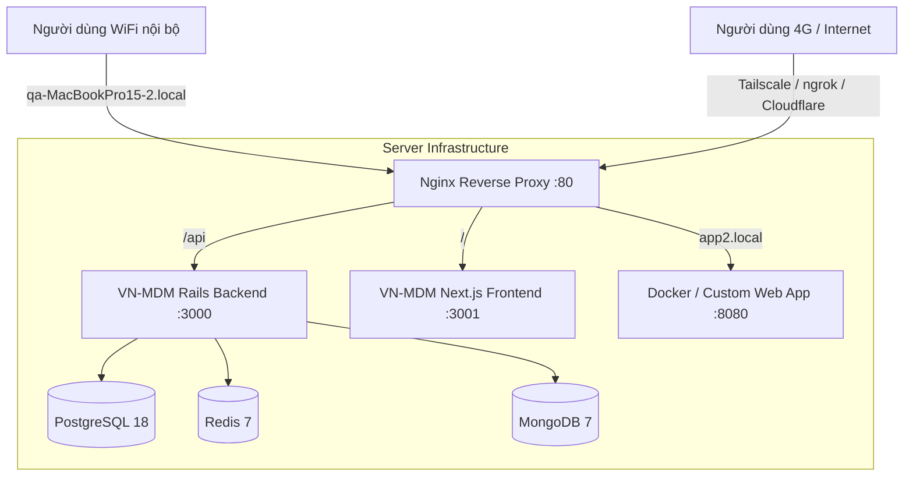

# 🚀 Universal Home Server Framework (Ubuntu)

Dự án này cung cấp hệ thống tự động hóa cài đặt, cấu hình và quản lý **Home Server 24/7** trên nền tảng Ubuntu Linux. Hỗ trợ đa dạng phần cứng từ **MacBook Pro T2**, **Laptop thông thường**, **Desktop PC**, **Intel NUC** đến **Cloud VPS**.

Mục đích chính là biến chiếc máy tính gia đình thành một Server tin cậy để **host nhiều ứng dụng đồng thời** (Rails, Next.js, Docker, Python, Go...), có thể truy cập ổn định từ mạng Wi-Fi nội bộ (LAN) cũng như từ xa qua Internet (WAN / VPN).

---

## 🎯 Tính Năng Nổi Bật

* ⚡ **Cài đặt 1-Click End-to-End (`./bin/setup.sh`):** Tự động cài từ A-Z sau khi cài xong Ubuntu.
* 🤖 **Tối ưu cho AI Agent (Antigravity, Cursor, Gemini CLI):** Tự động phát hiện phần cứng, chạy non-interactive, có đầy đủ Agent Rules & Skills ([`AGENTS.md`](file://AGENTS.md)).
* 💻 **Hỗ trợ Đa Phần Cứng (Hardware Profiles):**
  * **MacBook T2 Chip (2018-2020):** Tự động tích hợp kernel `linux-t2`, driver bàn phím/trackpad và giải nén Wi-Fi firmware.
  * **Laptop:** Tự động tắt chế độ Sleep/Suspend khi gập màn hình (Lid close 24/7).
  * **Generic PC / NUC / VPS:** Tối ưu hóa gói dịch vụ nền tảng.
* 🌐 **Định Tuyến Đa Dự Án (Multi-Project Hosting):** Dùng Nginx Reverse Proxy điều phối giao thông cho nhiều ứng dụng chạy trên cùng 1 server.
* 🔑 **Kết Nối Từ Xa An Toàn:** Tích hợp sẵn Avahi (`.local`), Tailscale (VPN Mesh riêng tư) và ngrok (Public Tunnel).

---

## 🏗️ Kiến Trúc Hệ Thống



---

## ⚡ Quickstart (Cho Người Dùng)

Sau khi cài đặt hệ điều hành Ubuntu mới, mở Terminal và chạy:

```bash
cd ~/Documents/Ubuntu_install
sudo ./bin/setup.sh --auto
```

Và thế là xong! Máy của bạn đã trở thành một Web Server hoạt động 24/7.

---

## 📚 Hệ Thống Tài Liệu (Documentation)

### 🧑‍💻 Tài liệu dành cho Người Dùng (Human User)
* 🚀 **[Hướng dẫn Nhanh (Quickstart)](file://docs/QUICKSTART.md)**: Các bước cơ bản để cài máy và truy cập.
* 💻 **[Hướng dẫn Cấu hình Phần cứng (Hardware Guide)](file://docs/HARDWARE_GUIDE.md)**: Chi tiết cấu hình MacBook T2, Laptop, PC.
* 🌐 **[Host Nhiều Dự Án (Multi-Project Hosting)](file://docs/MULTI_PROJECT_HOSTING.md)**: Cách thêm dự án web thứ 2, thứ 3 vào server.
* 🔑 **[Kết Nối Từ Xa (Remote Access)](file://docs/REMOTE_ACCESS.md)**: Hướng dẫn Tailscale, ngrok, Avahi mDNS.
* 🛠️ **[Xử Lý Lỗi (Troubleshooting)](file://docs/TROUBLESHOOTING.md)**: Các lỗi thường gặp và cách khắc phục.

### 🤖 Tài liệu dành cho AI Agent
* 🤖 **[Master Agent Guide (`AGENTS.md`)](file://AGENTS.md)**: Quy chuẩn và bộ kỹ năng cho AI Agent.
* 🧠 **Agent Skills Index:**
  * [System Setup Skill](file://.agent/skills/system_setup/SKILL.md)
  * [Server Infrastructure Skill](file://.agent/skills/server_infrastructure/SKILL.md)
  * [Remote Access Skill](file://.agent/skills/remote_access/SKILL.md)
  * [Multi-Project Hosting Skill](file://.agent/skills/multi_project_hosting/SKILL.md)
