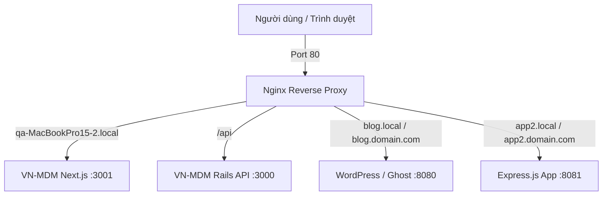

# 🌐 Hướng Dẫn Host Nhiều Dự Án Trên Cùng 1 Server (Multi-Project Hosting)

Mục đích của Home Server là cho phép bạn host **nhiều dự án web/API khác nhau** (Node.js, Rails, Python, Docker, Go...) trên cùng một chiếc máy tính duy nhất.

---

## 🏗️ Kiến Trúc Định Tuyến Nginx (Reverse Proxy)

Nginx đóng vai trò là "người điều phối giao thông" ở Cổng 80 (HTTP) và 443 (HTTPS). Tất cả truy cập từ bên ngoài sẽ đi qua Nginx trước khi tới ứng dụng của bạn.



---

## 📝 Các Bước Thêm 1 Dự Án Mới

### Bước 1: Cho ứng dụng chạy ở 1 Port nội bộ (Internal Port)
Ví dụ dự án mới của bạn là một ứng dụng Node.js chạy ở Port `8080`.

### Bước 2: Tạo Nginx VirtualHost
1. Copy file mẫu từ thư mục `apps/templates/`:
   ```bash
   sudo cp apps/templates/nginx-vhost-template.conf /etc/nginx/sites-available/my-new-app.conf
   ```
2. Mở file chỉnh sửa domain/subdomain và port proxy:
   ```nginx
   server {
       listen 80;
       server_name myapp.local myapp.yourdomain.com;

       location / {
           proxy_pass http://127.0.0.1:8080;
           proxy_set_header Host $host;
           proxy_set_header X-Real-IP $remote_addr;
       }
   }
   ```
3. Bật cấu hình và reload Nginx:
   ```bash
   sudo ln -sf /etc/nginx/sites-available/my-new-app.conf /etc/nginx/sites-enabled/
   sudo nginx -t
   sudo systemctl reload nginx
   ```

### Bước 3: Đảm bảo ứng dụng chạy 24/7 bằng Systemd hoặc Docker

**Dùng Docker Compose (Khuyên dùng):**
Sử dụng file mẫu `apps/templates/docker-compose-app.yml`:
```bash
docker compose up -d
```

**Dùng Systemd Service:**
Tạo file `/etc/systemd/system/my-new-app.service`:
```ini
[Unit]
Description=My New Application
After=network.target

[Service]
User=qa
WorkingDirectory=/home/qa/my-new-app
ExecStart=/usr/bin/npm start
Restart=always

[Install]
WantedBy=multi-user.target
```
Bật service:
```bash
sudo systemctl enable --now my-new-app
```
