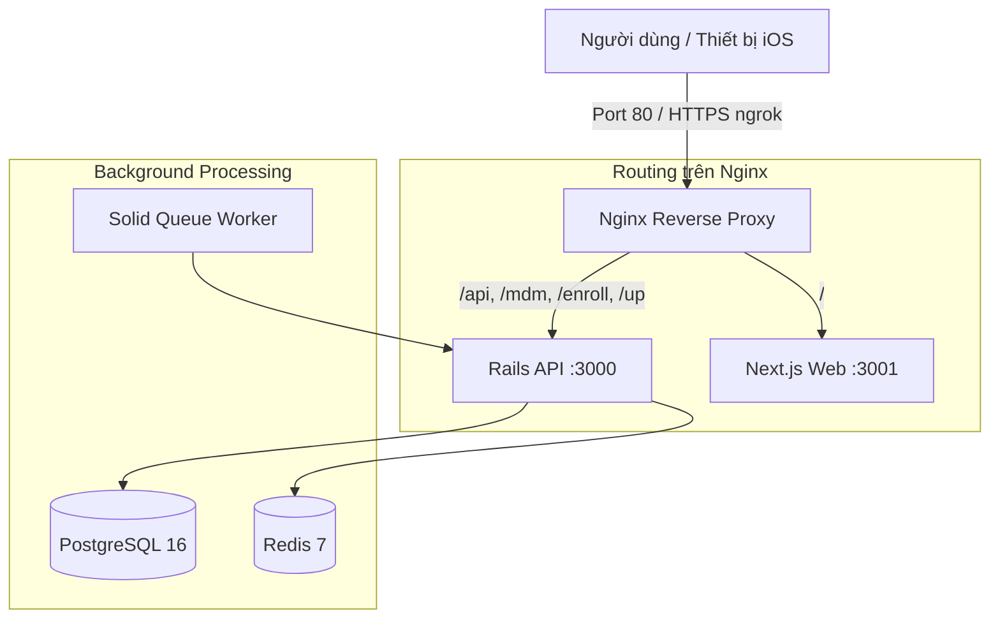

# 💻 Machine Runbook: MacBook Pro 2019 (T2) — 24/7 Ubuntu Server

Tài liệu này lưu trữ toàn bộ cấu hình chuẩn của chiếc máy hiện tại: **Apple MacBook Pro 15-inch 2019 (Chip T2, Model MacBookPro15,2)** chạy **Ubuntu Linux**. Máy đóng vai trò là Web Server hoạt động liên tục 24/7, cung cấp dịch vụ cho dự án **VN-MDM** (Backend Rails, Frontend Next.js, Solid Queue Worker, Nginx reverse proxy, ngrok HTTPS tunnel).

---

## ⚡ 1-Click Khôi Phục Hoàn Toàn (Zero-Thought Restore)

Sau khi cài mới Ubuntu trên chiếc MacBook này, bạn chỉ cần mở Terminal và chạy duy nhất lệnh sau:

```bash
git clone https://github.com/hoquanganh/setup-mac-ubuntu.git ~/Documents/Ubuntu_install
cd ~/Documents/Ubuntu_install
sudo ./bin/restore_current_machine.sh
```

Hoặc thông qua master script:
```bash
sudo ./bin/setup.sh --platform=ubuntu --hardware=t2-mac --profile=server-247 --app=vn-mdm --app-mode=native --auto
```

Script sẽ tự động hoàn tất 100% mọi thứ:
1. **Phần cứng T2:** Cài kernel `linux-t2`, trích xuất firmware Wi-Fi/Bluetooth từ máy chủ Apple, kích hoạt bàn phím, trackpad và audio.
2. **Nguồn điện:** Chống sleep khi gập nắp máy (`HandleLidSwitch=ignore`, mask toàn bộ `sleep.target`, `suspend.target`).
3. **Cơ sở dữ liệu:** Cài đặt và cấu hình PostgreSQL (`vnmdm` / `vnmdm`) và Redis.
4. **Môi trường chạy:** Node.js 22, Ruby (rbenv), Docker.
5. **Mạng nội bộ:** Cài đặt `avahi-daemon` với tên miền `qa-MacBookPro15-2.local`.
6. **Mạng từ xa:** Cài đặt Tailscale và OpenSSH.
7. **Web Server & Firewall:** Cấu hình Nginx reverse proxy trên cổng 80 và mở UFW.
8. **Dự án VN-MDM:** Clone repo, cài đặt gem, build frontend, cài 4 dịch vụ systemd (`vnmdm-backend`, `vnmdm-worker`, `vnmdm-frontend`, `ngrok-vnmdm`).

---

## 🌐 Thông Tin Truy Cập Máy Hiện Tại

- **WiFi nội bộ (LAN):**
  - Website: `http://qa-MacBookPro15-2.local` hoặc `http://172.26.25.62`
  - SSH: `ssh qa@qa-MacBookPro15-2.local`
- **Mạng riêng Tailscale (VPN):**
  - IP ảo: `http://100.x.y.z`
  - SSH: `ssh qa@100.x.y.z`
- **Công khai qua ngrok (Internet / Thiết bị di động bên ngoài):**
  - URL HTTPS tự động cập nhật qua dịch vụ `ngrok-vnmdm.service`.

---

## 🏗️ Kiến Trúc Dịch Vụ Hệ Thống



---

## 🛠️ Lệnh Quản Lý Dịch Vụ Hàng Ngày

```bash
# Kiểm tra trạng thái toàn bộ dịch vụ
sudo systemctl status nginx vnmdm-backend vnmdm-worker vnmdm-frontend ngrok-vnmdm

# Xem logs trực tiếp
journalctl -u vnmdm-backend -f
journalctl -u vnmdm-worker -f
journalctl -u vnmdm-frontend -f
journalctl -u ngrok-vnmdm -f

# Khởi động lại dịch vụ
sudo systemctl restart vnmdm-backend
sudo systemctl restart vnmdm-frontend
```
